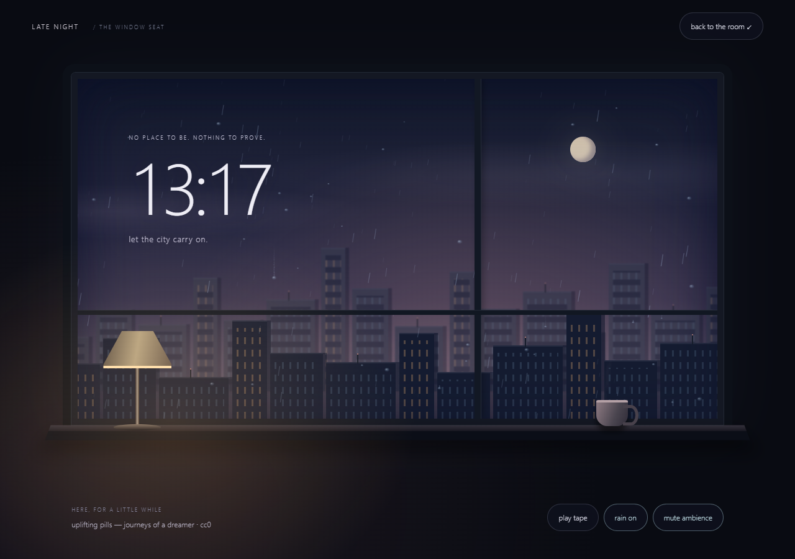

# Late Night

A tiny digital room for quiet evenings.

**[Open it →](https://ahsoka1tano.github.io/late-night/)**

Open it late, pick a mood, sit for a bit, close it.
No accounts, no backend, no notifications — just a dark little corner of the internet.



## The window seat

Choose a mood, then **Take the window seat**. The controls give way to a night
city, a live clock, clouds, a passing train and a cup of tea. Click the desk lamp
to turn its warm light off or on; the room remembers your choice.

Music and ambience continue playing. Tape and rain controls stay within reach,
and the official radio player stays visible when you're listening to Lofi Girl.
**Back to the room** or **Esc** returns to your place. Reduced motion is respected.

## Right now

- a slow night screen with a live clock
- six atmospheres: Calm, Music, Focus, Rain, Space, Sleep
- real rain falling past the window, with drops sliding down the glass
- out-of-focus city lights behind it, drifting as you move
- a slow star field in the space mood with real depth — near stars swing
  further than far ones — and once in a long while something crosses it
- a tape deck in the music mood: twenty hours of freely licensed tapes,
  or five of Lofi Girl's radio channels in her own player;
  if a stream is out of reach, a small synth keeps the room humming
- a calm mood that breathes: a slow glow in, a slower glow out
- a sleep mood that dozes off on its own if you stop touching anything
- drizzle, steady or downpour — heavy rain blurs the city away
- and you can hear it too: every mood with a sound has a `listen` switch —
  rain on three settings, an ocean for calm, a fireplace for focus,
  rain far away for sleep, and a quiet space drone in Space and Aurora;
  the switch shows when a recording is still tuning in
- a focus timer that lives inside the focus mood: 15, 25, 45 or 60 minutes,
  ending with a quiet line instead of an alarm, with a soft progress line
- the countdown shows in the tab title, so it keeps you company from another window
- one quiet line for tonight, the same all evening, a different one tomorrow
- a tiny journal with thumb-sized mood chips on phones and a quiet character count
  — notes wrap across lines and save immediately, together with the selected emotion
- a faint line of traces at the bottom: nights here, evenings in a row,
  finished sessions and minutes focused
- the room remembers the mood you left it in

There is one more mood than the six you can see. It is not behind a button.

## Lo-fi + rain

Choose **Music**, press **play** on the tape (or start a Lofi Girl radio), then
**add real rain**. Music and weather have independent volume sliders. Drizzle,
steady rain and downpour work here too; changing weather leaves the music alone.
Your weather choice is remembered. Browsers may require **listen** after a reload.
If a rain recording is unavailable, **retry** appears; rain is never replaced by
generated noise. The recordings need an internet connection.

## Keys

| key | what it does |
| --- | --- |
| `1` … `6` | pick a mood |
| `[` `]` | softer / harder rain |
| `space` | start or pause the focus timer |
| `↑` `↓` | volume of whatever is playing: the tape in music, the room elsewhere |

## Running it

No build step. Open `index.html`, or serve the folder:

```bash
python -m http.server 5173
```

Then visit <http://localhost:5173>.

## Journal

Write up to 140 characters, including line breaks. Each edit saves the note and
emotion together on this device. If saving fails, the draft stays in the editor
with a visible message; editing again or leaving the field retries the save.
Unreadable stored notes are never silently replaced with an empty journal.

When you return to the tab after midnight, the editor opens the new day once the
previous draft is saved. A note being written across midnight stays with the
evening it began. Localhost and the published site have separate journals.

Open **previous nights** below the editor to read older notes and emotions.
The newest evenings appear first, seven at a time; **older nights** reveals the
next seven. Today's draft stays in the editor. Existing notes use their original
local dates, and browsing the history never edits them.

## Browser checks (optional)

These checks use isolated browser profiles and sample notes. They cover immediate
reload, fast emotion changes, storage failures, midnight, history ordering and
pagination, safe rendering of note text, and mobile and desktop layouts.
The website itself needs no dependencies or build step.

```bash
npm install --no-save --package-lock=false playwright
npx playwright install chromium
node --test checks/journal.test.cjs checks/atmosphere.test.cjs
```

To use an installed Edge instead, set `PLAYWRIGHT_CHANNEL=msedge`. A separately
installed Playwright can be selected with `PLAYWRIGHT_MODULE` (its module path).

Atmosphere checks cover simultaneous layers, independent volume, recording errors,
weather persistence, window controls, keyboard access, radio continuity and layouts
at 320, 844 and 1280 pixels. They use a deterministic media double, so they do not
prove availability or audibility of external recordings. Set `ATMOSPHERE_PREVIEW_DIR`
to an existing folder to save screenshots.

## The tapes

Nothing is hosted here. The tape side streams from the Internet Archive:

| tape | licence |
| --- | --- |
| Lofi Lion — Tame the Beast | [CC BY 4.0](https://creativecommons.org/licenses/by/4.0/) |
| Uplifting Pills — Chill Pill 11, 17, 19 | [CC0](https://creativecommons.org/publicdomain/zero/1.0/) |
| Nature Sounds — Rain Sounds (rain, and the rain in sleep) | [CC0](https://creativecommons.org/publicdomain/zero/1.0/) |
| Ocean and Sea Sounds — Gentle Ocean (calm) | [CC0](https://creativecommons.org/publicdomain/zero/1.0/) |
| Relaxing Sounds — Blazing Fireplace (focus) | licence not stated by the uploader |

The radio side is [Lofi Girl](https://www.youtube.com/@LofiGirl)'s own live streams —
lofi hip hop, lofi house, synthwave, summer lofi and deep sleep — embedded with
YouTube's own player. Her stream ids change when she restarts a broadcast.

The space ambience is [Floating in Space](https://opengameart.org/content/floating-in-space) by Umplix (CC0), stored in the project so playback does not depend on OpenGameArt's file server.

## Stack

HTML, CSS, vanilla JS. On purpose.

Nothing leaves the browser: the mood, the journal and the settings live in `localStorage`,
there is no account, no server and nothing to sign up for.

## Roadmap

See [ROADMAP.md](ROADMAP.md) — it grows a little every evening.
