# Late Night

A tiny digital room for quiet evenings.

**[Open it →](https://ahsoka1tano.github.io/late-night/)**

Open it late, pick a mood, sit for a bit, close it.
No accounts, no backend, no notifications — just a dark little corner of the internet.


## Choose an evening

The illustrated cards at the top set up a whole evening with one click:

- **Rainy records**: a lo-fi tape, real steady rain, the city and amber light.
- **Mountain hideaway**: a lo-fi tape, clear mountain skies and moon-coloured light.
- **The last light**: Sleep, distant recorded rain, mountains and a dim lamp.
- **Harbour after hours**: Calm, a real ocean recording, the coast, amber light and tea.
- **The last café**: a lo-fi tape, real light rain, coffee and a warm shop across the street.
- **Midnight garden**: a lo-fi tape, real drizzle, tea and a glowing greenhouse beside a pond.

Choosing a card starts its sounds. You can then change any dial; the selected
card loses its highlight when the setup no longer matches. Existing notes remain.

**Keep this evening** saves your current mood, view, weather, light and sound
choices on this device. **Your evening** restores that setup, including an off
lamp and a paused tape. Saving again replaces the saved setup. **Forget saved setup**
removes that shortcut without changing the room or stopping playback.
The selected tape is still managed separately by the tape shelf.


## A postcard from your window

Press **✉ postcard** above the window, including in Quiet room. A small workshop
captures an illustration of the current view using the room's own vectors:
city lights, mountains, the coast, the café or the midnight garden, with the
current sky, moon, rain and frame finish.

Add an optional caption of up to 80 characters, choose **night ink** or **moon
paper**, and decide whether to **include the time** beside the date. **Keep as
PNG** downloads a 1280 × 920 image. Nothing is uploaded or sent to a service.
The caption is plain text and stays in this open page; journal text is never
copied into a card automatically.

The view is captured when the workshop opens. Music, focus and window journeys
continue, while the card keeps that moment. **Capture this view again** takes
a fresh illustration without clearing your caption. Closing and reopening also
captures the latest view. Escape or the close button returns to the window;
keyboard focus stays inside the workshop while it is open.

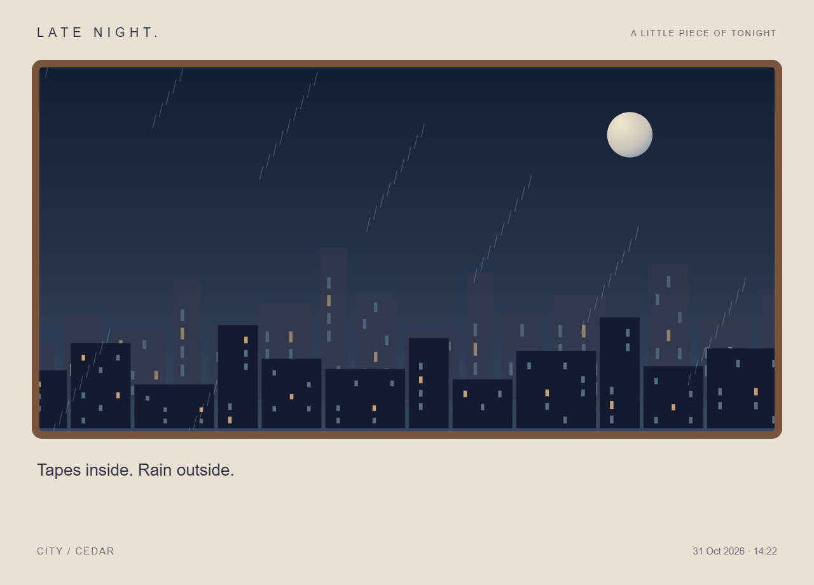

## The room around the view

Press **◇ room finish** above the window to try three materials:

- **Cedar**: long wooden grain, warm window rails and a broad wooden sill.
  It is the starting finish when no preference has been saved.
- **Midnight steel**: the original dark frame and crossed panes.
- **Orbital**: a rounded observation window, metal rim, small rivets and a
  low light along the hull. The horizontal crossbar leaves the view open.

Choices preview immediately. Keep the panel open to compare, close it with
**×**, or press Escape. Escape closes the finish panel before leaving Quiet
room; clicking outside also closes it. The control works in Quiet room and
on a phone, with scrolling available in short windows.

The finish stays independent of your mood and all five views. Tape, radio,
rain, focus sessions, journeys, glass sketches and lantern flights keep their
place. The lamp adds a faint edge reflection to Cedar and Orbital; switching
the lamp off removes that reflection. The orbital hull light rests in hidden
tabs and with reduced motion.

Your choice is remembered locally and included in **Your evening** and named
collected rooms, with matching small frames on their cards. Older saved rooms
keep the current material. Choosing a ready-made evening also keeps the finish
you chose. Storage failures leave the previous saved choice intact while the
new look works for this visit.

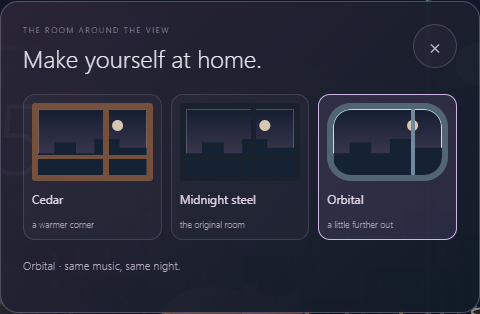

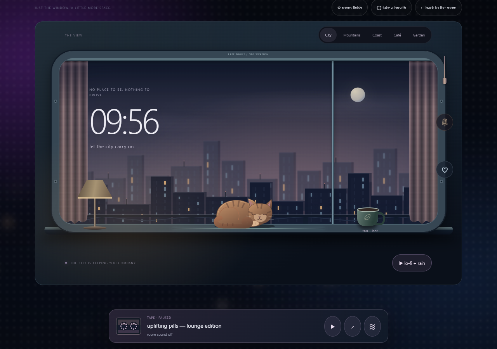

## A player within reach

The **Pocket player** stays at the bottom of the screen, including in **Quiet
room**. It follows the current tape, official radio or room recording, so you
can keep listening without scrolling back to the desk.

- **Play / pause** controls the tape, or the room recording in other moods.
  Pausing a tape leaves rain playing. **Next** follows your tape queue first.
- **≋** opens a small mixer with separate tape and room volume, an independent
  room-sound switch, and the existing real-rain switch in Music mood.
- **All quiet** stops tapes, room recordings and the radio. Your focus session,
  window journey and sound deadline keep their own state.

The mixer shows the full recording name. When a tape supplies a duration,
its position appears here too; seeking while paused keeps it paused. The
ordinary desk controls and the Pocket player share the same audio and levels.
Loading, unavailable recordings and muted levels have their own labels.

YouTube keeps its own transport and volume controls. **Radio ↗** takes you to
the existing embedded player, leaving Quiet room if necessary. The Pocket
player reports whether that player is open; it does not guess whether YouTube
is currently audible. Opening the controls preserves an existing iframe.

**Minimize player** inside the mixer folds it into a small title button. Click
that button to expand it. Resizing keeps playback unchanged, and the layout is
remembered on this device. Remembering the layout does not start any audio.
Escape closes the mixer first; another Escape can then leave Quiet room.
Clicking outside also closes the mixer. Reels rest in hidden tabs and with
reduced motion. Narrow screens and short landscape windows can scroll the mixer.

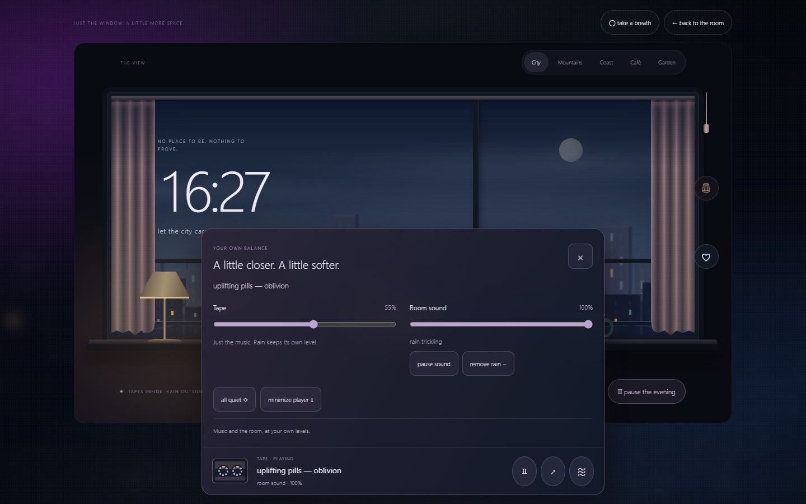

## Let the window wander

Under the mood buttons, choose a **Night journey**. The illustrated routes move
only the view, keeping your current tape or radio, rain, light and desk objects.

- **After hours**: City → Café → Garden.
- **Far away**: Mountains → Coast → Garden.
- **The long way**: City → Café → Garden → Mountains → Coast.

Choose **30 sec**, **1 min** or **3 min** at each window, then press a route card.
You arrive at the window immediately. If your current view is on that route,
the journey begins there; otherwise it starts at the first stop. Routes loop.
A small ticket on the glass shows your current stop and a gentle progress line.

**Pause** stays at the current view and keeps the unspent time. **Next view** or
a numbered stop changes the view immediately, even while paused. **Stay here**
ends the route without moving you. The compact controls above the window also
work in **Quiet room**. Choosing a view yourself or opening a saved evening
ends the journey so your choice can stay.

Hidden tabs wait at their current stop; returning resumes the remaining time,
without skipping through places you missed. Reduced motion keeps the progress
line still and removes animated scene transitions. Your last route and pace are
remembered locally, but a reload never starts a journey automatically. Saved
room setups keep the current view, with no running journey attached. Focus
sessions, journal entries, the tape queue and sound deadlines stay independent.

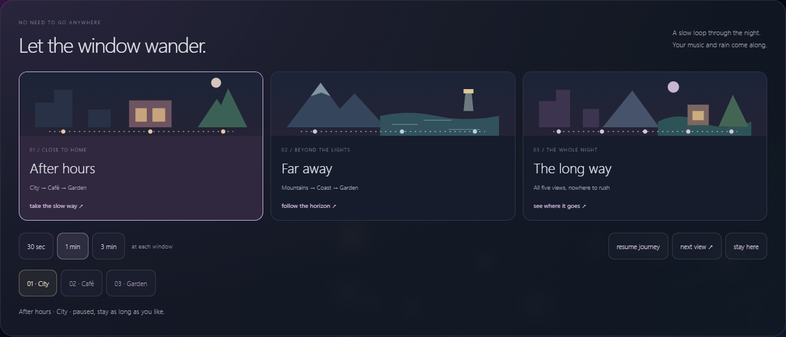

## A collection of your own evenings

Open **Your collected evenings**, just below the ready-made cards. Settle the
room, give it a name and press **collect this room**. Up to eight named setups
can stay on this device, each with a small illustration of its view, sky and
curtains. Collecting and renaming do not change the current room or its playback.

Open a collected card to restore its mood, view, rain, ambient choice, lighting,
drink, cat and curtains, including saved off and paused states. A room saved with
active sound starts that sound when opened. As with the original quick save,
the selected cassette and volume settings remain managed by the player; focus
sessions, sound deadlines and journal notes continue independently.

**Rename** changes only the name. **Remove** makes space; **undo removal** brings
back the most recently removed card during this visit, unless all eight places
have since been filled. Names are plain text and can be up to 40 characters.
The original **keep this evening** shortcut remains separate from the collection.

The collection lives in localStorage, with no account or upload. If saving fails,
the previous collection and the name draft stay in place. Unreadable data is left
untouched; reopening retries the read. There is no cloud backup.

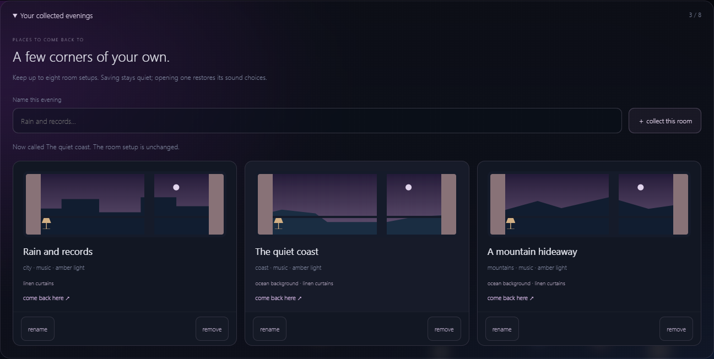

## The midnight garden

Choose **Garden** above the window for a fifth view: a glass greenhouse, layered
trees, a lily pond and small path lights. Changing the view keeps your current
music, rain, focus session and journal. **Midnight garden** at the top sets up a
whole evening with a lo-fi tape, real recorded drizzle, tea and a low amber lamp.

Touch **GLASSHOUSE · LIT** in the window to let the greenhouse rest. The same
button works in **Quiet room**, including with Enter or Space. In **Outside
sky**, garden controls switch the greenhouse light and fireflies independently.
The desk lamp and sounds keep their own settings.

Fireflies wander slowly above the pond, appearing fainter in rain. Pond rings
move more quickly in wet weather. These animations pause when the tab is hidden
or another view is selected; reduced motion leaves a still garden.

Light and firefly choices are remembered on this device, including in both quick
saved evenings and your named collection. Older saved evenings leave the current
garden choices in place. If storage is unavailable, the controls still work for
the current visit and explain that the choice could not be remembered.

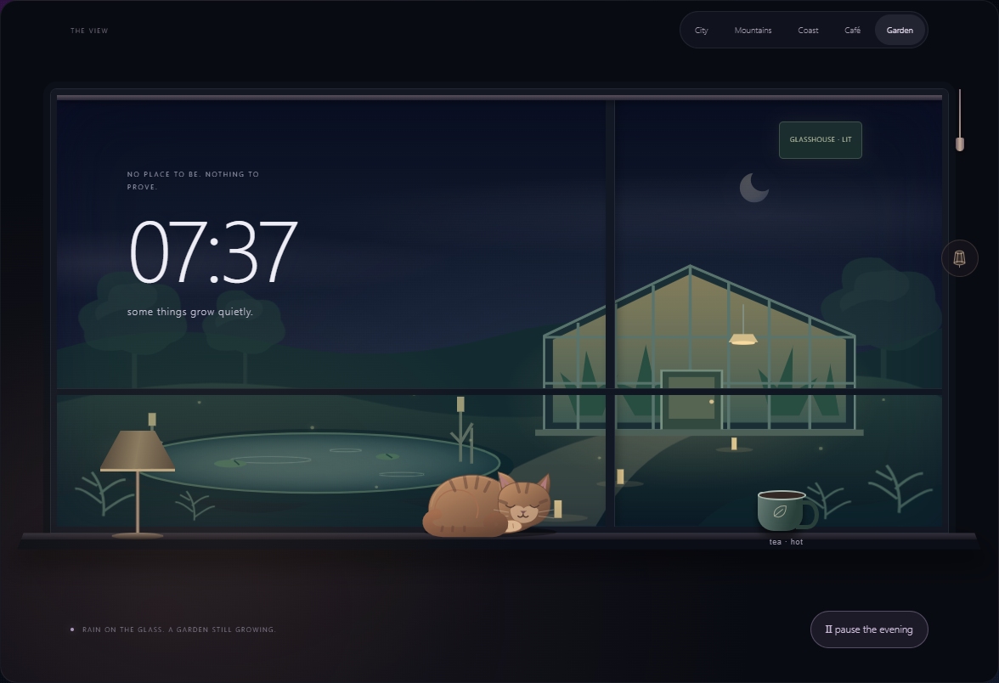

## Draw on the glass

In **Draw on the glass**, press **start drawing**. A veil of mist settles over
the window; trace through it with a mouse, finger or pen to reveal the view.
Choose **fingertip** or **a little wider** for the next stroke. The brush width
is remembered on this device; the drawing itself is never saved or sent.

**Pause drawing** leaves the marks in place and lets you use the window normally.
Escape also pauses drawing. **Mist over again** starts a fresh misted pane;
**let it clear** removes the mist and every mark. Reloading also clears drawings.

For a small ready-made trace, use **trace a heart** or **a small moon**. These
buttons work with the keyboard and bring the window into view. The **♡** button
beside the window traces a heart directly, including in **Quiet room**; it becomes
**×** to clear the glass without leaving the window.

Drawings keep their proportions when the window changes size. An interrupted
touch or a hidden tab releases the gesture; painting only runs when the glass
changes. Views, curtains, music, real rain, focus sessions and journal notes
continue independently. Saved evenings keep room settings, never the marks.

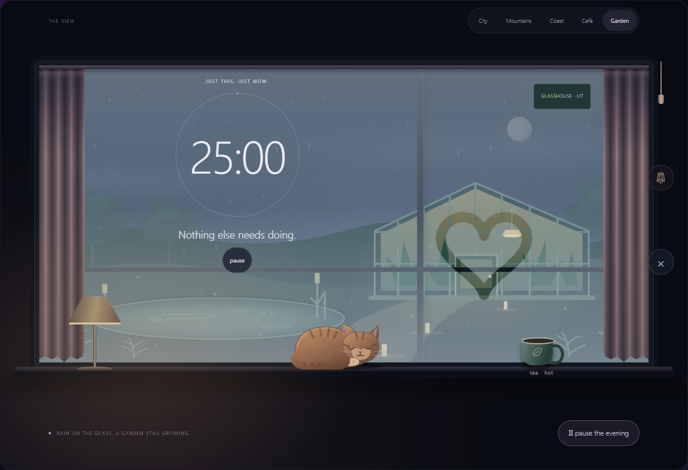

## Let it drift

Release a glowing paper lantern outside the window. In **Let it drift**, choose
**amber**, **rose** or **moon**, then press **release a lantern**. You can add a
short passing thought, or leave it blank. The room brings you back to the window
to watch it rise. The small lantern button beside the glass also works in
**Quiet room**, with Enter or Space.

Up to three lanterns can drift at once. Each passes in 30 seconds; **clear the
sky** removes them sooner. Notes exist only for their flight: they are never
saved or sent. The colour is remembered on this device and included in your
saved evenings, without saving notes or launching lanterns when restored.

Music, rain and focus continue independently. Hidden tabs pause the animation
and remove expired flights on return. With reduced motion, lanterns stay still
before disappearing.

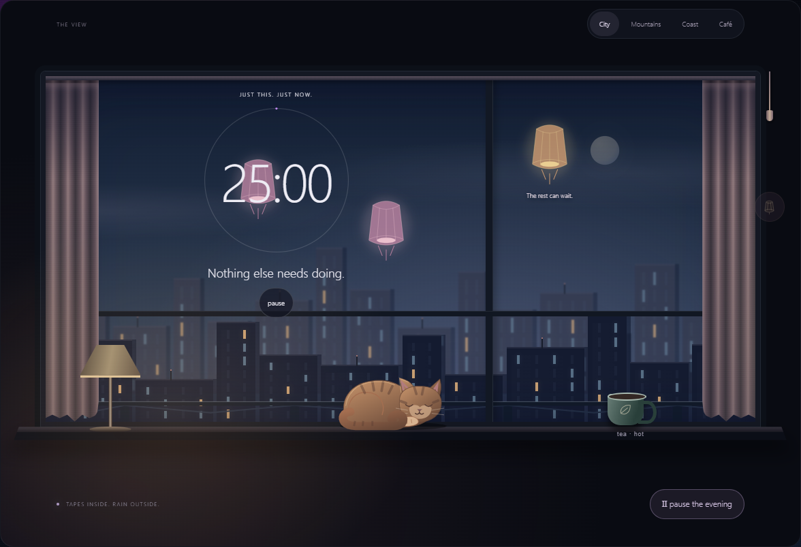

## Draw the night in

The window now has softly folded curtains with three fabrics: **linen**, **plum**
and **ink**. In **Draw the night in**, choose **open**, **framed** or **sheltered**,
or use the slider for a position between them. Sheltered leaves a central glimpse
of the night; the clock and focus controls remain readable above the cloth.

The small pull to the right of the window cycles through framed, sheltered and
open. It also works with Enter or Space, including in **Quiet room**. Curtain
controls change the room without starting or replacing music, rain or radio.
The fabric catches a little of the desk lamp's colour; switching the lamp off
removes that glow. Reduced motion makes position changes immediate.

Fabric and position are remembered on this device and included in **Keep this
evening**. Existing saved evenings without curtains retain the current choice.
Ready-made evenings have their own folds: the harbour opens the window, the last
light draws ink curtains, and the café has plum fabric around its warm street.

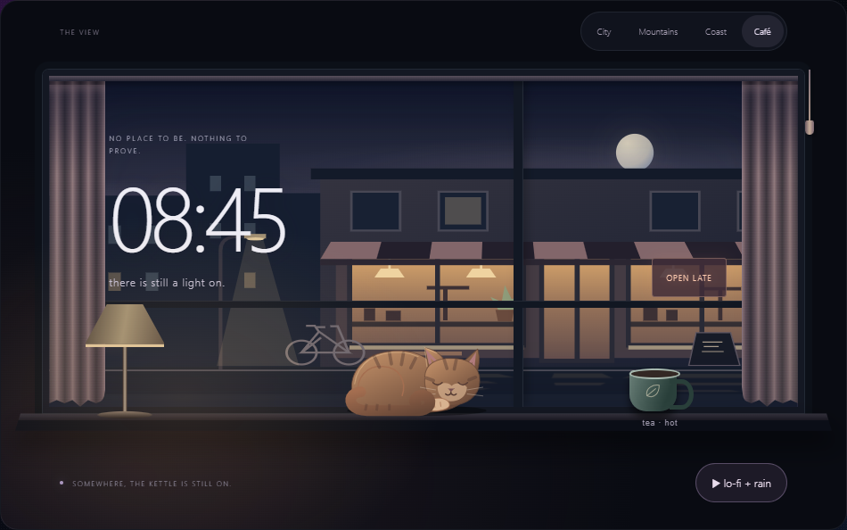

## A few records for later

**Up next** sits below the tape player. Add the current recording with **＋ this
tape**, or open the cassette shelf and use **＋ up next** under any recording.
Up to eight different tapes can wait in order. Adding a tape does not start or
replace the current recording.

Use **↑** and **↓** to change the order. **×** removes one upcoming tape;
**undo removal** brings back the last removed item during this visit, if there
is still room. **Clear queue** removes the upcoming list without stopping music.
All actions work with the keyboard and have names that include the recording.

**Cue next** and the player's **next** button choose the first available queued
recording. Playing stays playing; paused stays paused. When a playing tape ends,
the next queued recording follows automatically. Real rain keeps playing through
the change. When the queue is empty, Next follows the regular shelf and its saved
tapes filter. Radio channels keep their own player and do not consume the queue.

The upcoming order is remembered on this device, separately from saved room setups.
Reloading restores the list without starting a tape. A recording missing from the
current catalogue stays labelled in the list and is skipped for playback; you can
remove it or wait for the catalogue to return. Queue entries only play recordings
already in the curated shelf.

If saving fails, edits work for this visit and the previously saved order remains.
Unreadable stored data is left untouched; reload retries the read. A failed audio
load offers the existing retry controls rather than silently consuming more tapes.

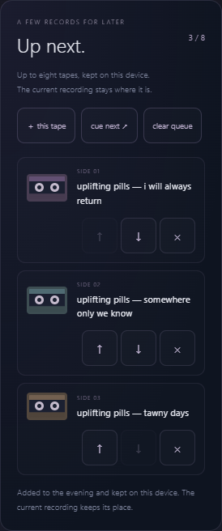

## Somewhere else: a shelf of sound

In the room controls, **Somewhere else** has four illustrated recording cards:
**Rain**, **Ocean**, **Fireplace** and **Space**. Choose one, then press **listen**.
Choosing a card while paused only cues the sound. While listening, it switches
the background without restarting a tape or the official radio player.

The chosen recording stays with you across moods, independently of the view and
visible weather. Rain has the same drizzle / steady / downpour dial even under
a clear sky. The room volume and sound timer apply to every background.
**Follow the mood** returns to the original mood-based recordings.

The window button starts lo-fi together with your chosen background; it keeps
clear weather clear. With **follow the mood**, it starts the original lo-fi and
rain evening. **Add real rain** returns to that mood-based rain setup.

Your sound choice is remembered on this device and included in **Keep this
evening**. Ready-made cards restore their own original sound setups. An older
saved evening still works and follows its mood. Each recording has a source and
credits link; loading failures offer **retry**. Rain, ocean and fireplace stream
from the Internet Archive; Space uses the existing local CC0 recording.

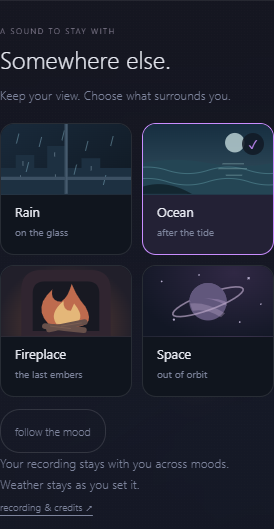

## An album of quiet nights

Below the room, open **previous nights → night album**. Marked dates hold your
saved notes and feelings; blank dates stay quiet. Browse months or choose a day
to read a small illustrated postcard. **Older night** and **newer night** move
between saved entries, including across month boundaries.

Reading a past evening leaves tonight's editor in place. The album also includes
today's saved note, updates after a successful save, and remembers whether you
prefer the album or the original list. Different feelings tint the postcard's
illustration.

**Download saved notes · .txt** prepares a plain text file of saved entries,
newest first, with dates, feelings and original line breaks. The file is made
locally in your browser. Your journal stays in localStorage; there is no upload,
account or cloud copy. An unreadable journal offers a retry instead of an empty
export.

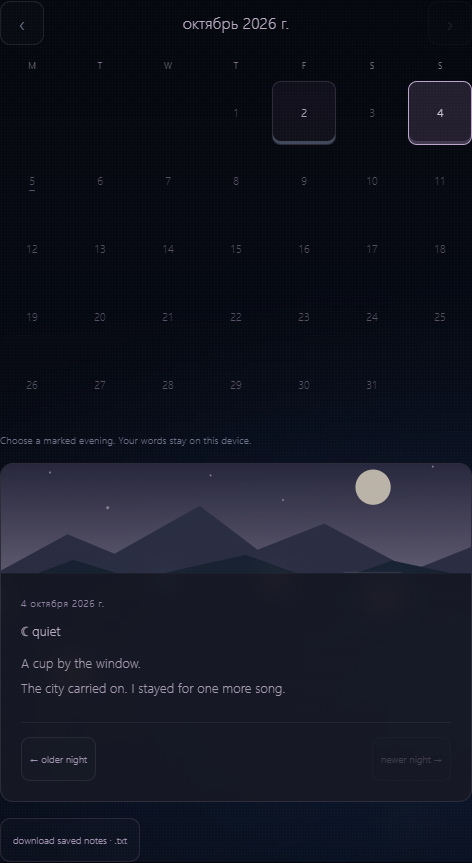

## A shelf of real cassettes

In **Music → tape**, **browse the cassette shelf** opens an illustrated collection
below the room. Search by artist or recording title, save a cassette with its
heart, or show only your saved recordings. Twelve cards appear at a time;
**more recordings** reveals the next group. Closing the shelf returns to the deck.

Choosing a card preserves playback state: a paused deck cues the recording,
and a playing deck starts it. Rain keeps going. Hearts save recordings without
selecting or playing them. The compact native tape selector remains available.

The deck shows elapsed time and duration once the recording supplies them.
The seek bar works during playback and while paused. **Recording and credits**
opens the original source page. If a recording cannot load, the deck offers
**retry**, another cassette or radio. There is no generated replacement music.


## Let the sound end softly

**A little longer**, in the room controls, sets a **15, 30 or 60 minute** sound
timer. It starts no playback. In the final minute, tapes and ambient recordings
fade together without changing your volume settings. The official radio stops
at the end; its embedded player does not fade.

The small moon countdown at the window stays available in **Quiet room**. Touch
it to cancel and keep listening at your chosen volume. **Turn off the desk lamp
at the end** is optional and starts unchecked. The focus timer and journal continue
independently; stopping the sound does not finish a focus session.

The deadline and lamp choice stay on this device. Refreshing keeps the original
end time. An overdue timer stops remembered ambience before it can start, and
the finished state never starts another recording. Suspended tabs catch up as
soon as the browser resumes; the timer uses elapsed wall time.


## A quiet minute

Choose **take a breath** above the window for a short rhythm of light on the glass.
It works with any mood: your lo-fi, rain, radio and focus timer keep going. The
same controls remain at the window in **Quiet room**. Pause or leave whenever you like.

In **Calm**, the desk offers **1, 3 or 5 minutes** and two rhythms: **gentle**
(four seconds in, six out) or **even** (four in, four out). Duration and pace stay
on this device. Reset the current ritual before changing them. Refreshing the
page starts no ritual automatically; there are no streaks or focus points for this.

Leaving the tab pauses the rhythm, and returning waits for **continue**. Reduced
motion keeps the light still while the phase text continues. Screen readers get
one announcement per phase. Sleep waits until the rhythm finishes before dimming
the room again. At the end, nothing else starts: just a little space to sit.


## The last café on the street

Choose **Café** in the view switch for a warm storefront, striped awning, a bicycle,
a little menu board and a pool of street light. Rain adds window reflections on
the pavement and slow rings in the puddles. Motion pauses in hidden tabs and stays
still with reduced motion enabled.

Touch **OPEN LATE** in the shop window to dim the café for the night; **GOOD NIGHT**
brings its lights back. The same switch is in **Outside sky** when Café is selected.
This changes the shop, leaving your desk light and playback alone. Its state is
remembered and can be included in **Your evening**; older saved rooms still work.

**The last café** at the top sets up the scene with a real light-rain recording,
your selected lo-fi tape and a cup of coffee. You can also change just the view
without touching your music, focus session or notes.


## A little company

There is a sleeping cat between the lamp and your cup. Touch it, or focus it and
press Enter or Space: a slow blink, a little tail movement, then back to dreaming.
Its breathing is quiet; there are no sounds to interrupt your recording.

In **Window company**, choose **ginger**, **ink** or **moon**, or turn the companion
off for an empty sill. The choice stays on this device and is included in
**Your evening**. Older saved evenings leave your current company choice alone.
Changing moods or views keeps the cat in the room, including **Quiet room**.

The desk lamp leaves a faint coloured edge on the fur. Motion pauses in hidden
tabs, and reduced motion keeps the illustration still while leaving touch and
keyboard reactions available. A tab that returns later lets the cat settle back
to sleep rather than replaying an old reaction.


## One small thing, by the window

Choose **Focus**, write one small intention and pick 15, 25, 45 or 60 minutes.
The window becomes a quiet clock with a circular progress trace. Start and pause
from the glass or the desk; Space still works outside text fields and buttons.
An active or paused session stays on the glass when you change moods, so you can
listen to a lo-fi tape and rain while working. Your intention is kept on this device.

**Quiet room** gives the window the screen, with music and weather continuing.
Use **back to the room** or Escape to bring the desk back. It also works without
a timer: just the view, your lamp and a drink. This mode opens only when requested.

When a session ends, **take five minutes** starts a short break with a softer
progress ring. No new work session starts automatically. Breaks do not add focus
minutes or sessions to your stats. **Back to focus** leaves the timer ready.

Running timers, pauses and breaks survive a refresh. A session that finished
while the page was closed is counted once when you return. A refresh does not
start music on the timer's behalf. All of this stays local to the browser.


## A night by the sea

**Coast** opens a rocky headland, distant harbour lights, slow swells and moonlight
on the bay. The lighthouse sweeps a soft beam over the water. Open **Outside sky**
to switch its beam off or on; the choice is remembered and can be kept in **Your evening**.
Water and light stop moving in a hidden tab, and reduced motion leaves a still view.

Choose **Harbour after hours** to start the existing real ocean recording alongside
the coastal scene. Changing only the view leaves your music and rain playing.
Clear coastal skies also support stars and the shooting-star control.


## A sky of your own

Open **Outside sky** in the room controls. Follow the mood, or choose **midnight**,
**violet** or **afterglow**. Pick a **full**, **half** or **crescent** moon. These
choices are remembered separately from your room lighting and can be kept in
**Your evening**. Previously saved evenings still work.

In clear **Mountains** or **Space**, **see a shooting star** brings you back to the
window for a short meteor trail. Automatic visitors are spaced a minute or more
apart, with timing independent of the display's frame rate. Rain and reduced
motion keep that control quiet; music continues throughout.


## A drink by the window

Click the cup to choose **tea** or **coffee**. The glaze and small emblem change,
and your choice is remembered. A freshly poured drink steams, settles after two
minutes and cools after five. **Warm it up** brings the steam back. Returning
after a hidden tab catches up with the elapsed time.

The ritual leaves music and rain playing. Escape closes the controls and returns
focus to the cup. Reduced motion hides the moving steam. **Your evening** can keep
your drink too; previously saved setups still work.


## One little room

Use **The view → City / Mountains / Coast / Café** above the window to choose the landscape.
The room remembers it separately from your mood. Changing the view preserves
playing music, real rain, the radio, your timer and journal.
The mountain window has layered snowy ridges, a pine shore, low mist and moonlight
on the lake. Stars appear in clear weather and fade when rain arrives. The scene
respects reduced motion and pauses its movement in a hidden tab.


The window is the home screen. Pick a mood above it: the city, lamp, clock and
weather share the page with your music controls. On a wide screen the player sits
beside the window; on a phone it sits below. There is no separate view to enter.
Click the lamp to change its warm light. Your last mood and lamp choice are remembered.
In **Desk light**, choose **amber**, **moon** or **dim**, then adjust brightness.
The lamp's glow, shade and faint reflection follow your settings. Choosing a tone
or moving the dimmer turns the light on; clicking the lamp switches it off again.
Tone, brightness and the off state are remembered independently of your mood and view.
New visitors arrive in Music; audio starts only after a user action or browser permission.

The journal and previous nights are just below the room. The official Lofi Girl
player stays on the desk while you change the rain or the lamp.

Press **lo-fi + rain** at the window to start a tape and real rain together.
The same button pauses both. Individual controls still adjust each layer, and
your volume settings are preserved. In Radio, use the official player's controls.
The room's sky follows your mood: warmer for Focus, cooler with Rain, quieter
for Sleep, with the city fading into the stars in Space.
Apartment windows glow unevenly: somebody switches a light on, somebody goes to
bed. In Sleep, the lights only go out. The city rests in a hidden tab and respects
reduced motion, including changes to that preference while the room is open.
Every so often a small aircraft crosses the sky; faint rooftop beacons keep it
company. Those details rest with the city; aircraft disappear from the space and sleep sky.
The night express has four carriages, warm compartment windows and a softly lit
cab. It crosses an elevated railway in front of the skyline, then leaves the view
quiet for a while. Its first pass begins shortly after opening the room.

## Right now

- a slow night screen with a live clock
- six atmospheres: Calm, Music, Focus, Rain, Space, Sleep
- real rain falling past the window, with drops sliding down the glass
- out-of-focus city lights behind it, drifting as you move
- a slow star field in the space mood with real depth — near stars swing
  further than far ones — and once in a long while something crosses it
- a tape deck in the music mood: twenty hours of freely licensed tapes,
  or five of Lofi Girl's radio channels in her own player;
  with recording progress, a searchable cassette shelf and a clear retry if a stream fails
- a calm mood that breathes: a slow glow in, a slower glow out
- a sleep mood that dozes off on its own if you stop touching anything
- drizzle, steady or downpour — heavy rain blurs the city away
- and you can hear it too: every mood with a sound has a `listen` switch —
  rain on three settings, an ocean for calm, a fireplace for focus,
  rain far away for sleep, and a quiet space drone in Space and Aurora;
  the switch shows when a recording is still tuning in
- a focus timer that lives inside the focus mood: 15, 25, 45 or 60 minutes,
  ending with a quiet line instead of an alarm, with a soft progress line
- the countdown shows in the tab title, so it keeps you company from another window
- one quiet line for tonight, the same all evening, a different one tomorrow
- a tiny journal with thumb-sized mood chips on phones and a quiet character count
  — notes wrap across lines and save immediately, together with the selected emotion
- a faint line of traces at the bottom: nights here, evenings in a row,
  finished sessions and minutes focused
- the room remembers the mood you left it in

There is one more mood than the six you can see. It is not behind a button.

## Lo-fi + rain

In Tape, **pick a tape for tonight** lets you choose a recording by name. The room
remembers your selection. Choosing another tape while playing changes only the
music; choosing one while paused leaves it paused. Rain and volume stay as you set them.
Press **♡ keep** to save a tape on this device. **Saved tapes** narrows the list,
and **next** then cycles through those recordings. Saving and filtering never start
playback. Remove the final saved tape to return to the full collection.

Choose **Music**, press **play** on the tape (or start a Lofi Girl radio), then
**add real rain**. Music and weather have independent volume sliders. Drizzle,
steady rain and downpour work here too; changing weather leaves the music alone.
Your weather choice is remembered. Browsers may require **listen** after a reload.
If a rain recording is unavailable, **retry** appears; rain is never replaced by
generated noise. The recordings need an internet connection.

## Keys

| key | what it does |
| --- | --- |
| `1` … `6` | pick a mood |
| `[` `]` | softer / harder rain |
| `space` | start or pause the focus timer |
| `↑` `↓` | volume of whatever is playing: the tape in music, the room elsewhere |

## Running it

Before publishing changed CSS, JavaScript or the train artwork, run
`node scripts/refresh-assets.cjs` and commit the updated `index.html`. The URLs
include a content fingerprint so browsers fetch the matching assets after an update.
The site still runs directly, without a build step.

No build step. Open `index.html`, or serve the folder:

```bash
python -m http.server 5173
```

Then visit <http://localhost:5173>.

## Journal

Write up to 140 characters, including line breaks. Each edit saves the note and
emotion together on this device. If saving fails, the draft stays in the editor
with a visible message; editing again or leaving the field retries the save.
Unreadable stored notes are never silently replaced with an empty journal.

When you return to the tab after midnight, the editor opens the new day once the
previous draft is saved. A note being written across midnight stays with the
evening it began. Localhost and the published site have separate journals.

Open **previous nights** below the editor to read older notes and emotions.
The newest evenings appear first, seven at a time; **older nights** reveals the
next seven. Today's draft stays in the editor. Existing notes use their original
local dates, and browsing the history never edits them.

## Browser checks (optional)

These checks use isolated browser profiles and sample notes. They cover immediate
reload, fast emotion changes, storage failures, midnight, history ordering and
pagination, safe rendering of note text, and mobile and desktop layouts.
The website itself needs no dependencies or build step.

```bash
npm install --no-save --package-lock=false playwright
npx playwright install chromium
node --test checks/journal.test.cjs checks/atmosphere.test.cjs
```

To use an installed Edge instead, set `PLAYWRIGHT_CHANNEL=msedge`. A separately
installed Playwright can be selected with `PLAYWRIGHT_MODULE` (its module path).

Atmosphere checks cover simultaneous layers, independent volume, recording errors,
weather persistence, the unified room, keyboard access, radio continuity and layouts
at 320, 844 and 1440 pixels. They use a deterministic media double, so they do not
prove availability or audibility of external recordings. Set `ATMOSPHERE_PREVIEW_DIR`
to an existing folder to save screenshots.

## The tapes

Nothing is hosted here. The tape side streams from the Internet Archive:

| tape | licence |
| --- | --- |
| Lofi Lion — Tame the Beast | [CC BY 4.0](https://creativecommons.org/licenses/by/4.0/) |
| Uplifting Pills — Chill Pill 11, 17, 19 | [CC0](https://creativecommons.org/publicdomain/zero/1.0/) |
| Nature Sounds — Rain Sounds (rain, and the rain in sleep) | [CC0](https://creativecommons.org/publicdomain/zero/1.0/) |
| Ocean and Sea Sounds — Gentle Ocean (calm) | [CC0](https://creativecommons.org/publicdomain/zero/1.0/) |
| Relaxing Sounds — Blazing Fireplace (focus) | licence not stated by the uploader |

The radio side is [Lofi Girl](https://www.youtube.com/@LofiGirl)'s own live streams —
lofi hip hop, lofi house, synthwave, summer lofi and deep sleep — embedded with
YouTube's own player. Her stream ids change when she restarts a broadcast.

The space ambience is [Floating in Space](https://opengameart.org/content/floating-in-space) by Umplix (CC0), stored in the project so playback does not depend on OpenGameArt's file server.

## Stack

HTML, CSS, vanilla JS. On purpose.

Nothing leaves the browser: the mood, the journal and the settings live in `localStorage`,
there is no account, no server and nothing to sign up for.

## Roadmap

See [ROADMAP.md](ROADMAP.md) — it grows a little every evening.
